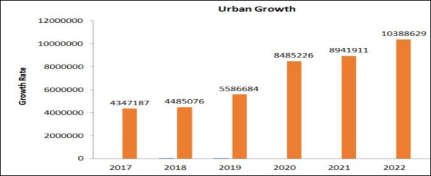

# Remote Sensing and GIS for Urban Area Extension

## Project Overview
This project leverages remote sensing technologies and Geographic Information Systems (GIS) to support urban planning. By integrating satellite imagery with machine learning algorithms, we analyzed urban growth patterns, providing insights valuable for city planners, engineers, and decision-makers.

## Objective
### Primary Goals:
- Extract building areas using Random Forest, CNN, NDBI, SVM, and Regression models.
- Map urban area growth from 2017 to 2022 and predict future trends for 2023.
- Conduct a literature survey on classification methods and machine learning algorithms for land use/cover mapping using remote sensing data.

## Methodology
- **Data Collection**: Utilized Sentinel-2 satellite imagery data.
- **Preprocessing**: Prepared data using tools like ENVI and SNAP.
- **Machine Learning Models**:
  - **Random Forest**: Achieved 98.79% accuracy in classifying urban, water, vegetation, and barren land areas.
  - **CNN**: Used for image classification and object detection with an accuracy of 91.43%.
  - **NDBI**: Applied to extract and highlight built-up areas using the ratio of SWIR and NIR bands.
  - **SVM**: Demonstrated challenges in accurately classifying different land types.
  - **Regression Models**: Used for predicting urban growth based on historical data.

## Outcomes
- Successfully identified urban areas and predicted growth patterns with high accuracy.
- Provided a comparative analysis of different machine learning models for urban area classification.
- Highlighted the strengths and weaknesses of each model in the context of remote sensing data.

## Challenges Faced
- Processing and analyzing large volumes of Sentinel-2 data.
- Ensuring accuracy across various machine learning models.
- Addressing data inconsistencies across different years.

## Results
- The Random Forest model was particularly effective in avoiding overfitting and providing robust predictions.
- CNNs, while effective, required substantial computational resources.
- NDBI was useful for differentiating built-up areas from natural landscapes.

### Performance of Different Algorithms
| **Algorithm**              | **Accuracy** | **Key Insights**                                                                                                                                       |
|----------------------------|--------------|---------------------------------------------------------------------------------------------------------------------------------------------------------|
| **Random Forest**           | 98.79%       | High accuracy in classifying urban, water, vegetation, and barren land areas. Avoided overfitting and handled data variations effectively.               |
| **Convolutional Neural Network (CNN)** | 91.43%       | Effective for image classification and object detection. Required significant computational resources.                                                  |
| **Normalized Difference Built-up Index (NDBI)** | N/A          | Successfully identified urban areas by emphasizing differences between SWIR and NIR bands. Relative NDBI values used for classification.               |
| **Support Vector Machine (SVM)**       | N/A          | Faced challenges in accurately classifying different land types, particularly due to misclassification in band colors (Red, Blue, Green).                |
| **Regression Models**       | N/A          | Used for predicting urban growth based on historical data. Assumes linear relationship, which might not be accurate for all cases.                       |

### Annual/Yearly Growth Graph

## Future Goals
- Explore integrating additional data sources, such as LiDAR or aerial imagery, to enhance predictions.
- Continue refining the methodology to adapt to new data and technology advancements.
- Contribute findings to academic journals and conferences, emphasizing sustainable urban development.

## Acknowledgments
This project was completed as part of an internship at the Indian Institute of Information Technology Allahabad under the guidance of Dr. Triloki Pant. Special thanks to the project team members for their collaboration and dedication.

